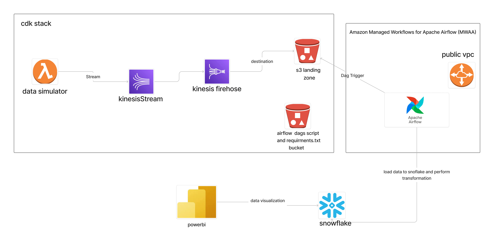

# End to end aws kinesis stream  firehose and snowflake pip line

The aim of this project solution is using lambda function as data simulation to stream customer and orders data to knesis stream. kinesis stream stream the data to kiness firehose then firehose load the data to s3 destination bucket and then trigger aws manage workflows for apache airflow to copy the data to snowflake data warehouse for query and transformation. and then create visualization on microsoft powerbi

# Architechure Diagram
